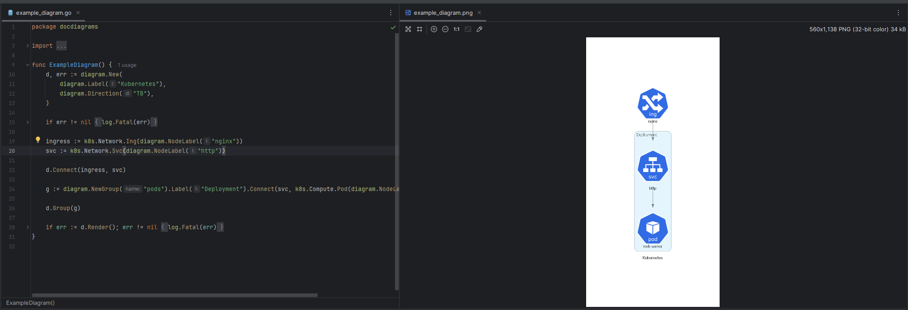

# Go-Diagram Generator

This Go program demonstrates how to generate diagrams using the `github.com/blushft/go-diagrams` library. It includes functions to dynamically generate and export the diagrams as PNG file.

## Prerequisites

Before running the program, ensure you have Go installed on your system. You can download and install it from the [official Go website](https://golang.org/dl/).

## Installation
1. Install GRAPHVIZ
   - mac 
      ```bash
      brew install graphviz
      ```  
   - linux
      ```bash
      sudo apt install graphviz
      ```  
   - windows
      ```bash
      choco install graphviz
      ```  

2. Clone this repository to your local machine:

   ```bash
   git clone https://github.com/your-username/dancing-api-diagram-generator.git
   ```

3. Navigate to the project directory:

   ```bash
   cd go-diagram-generator
   ```

4. Install the required dependencies:

   ```bash
   go mod tidy
   ```

## Usage

1. Create a go-diagram file at the `internal/diagrams` folder
    ```shell
    touch internal/diagrams/my_first_diagram.go  
    ```
2. Name the go function as the wanted name for the diagram. 
    ```
     Ex: MyFirstDiagram() will create my_first_diagram.png
    ```
3. Change the main() to use the target diagram func. ex:
    ```
    func main() {
	  diagram := docdiagrams.TaskManagerApi //CHANGE_ME
	  processor.CreateDiagram(diagram)
    }
    ```

4. To run the program and generate the diagrams, use the following command:

    ```bash
    go run main.go
    ```

5. The program will save the generated diagrams as PNG files in the `output` folder.

**To have better workability don't forget to keep both files open at split screen mode**



## Contributing

Contributions are welcome! Feel free to submit issues or pull requests if you find any bugs or have suggestions for improvements.

## License

This project is licensed under the MIT License - see the [LICENSE](LICENSE) file for details.
